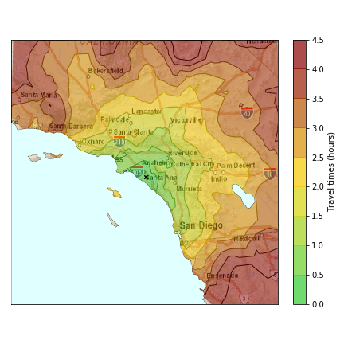
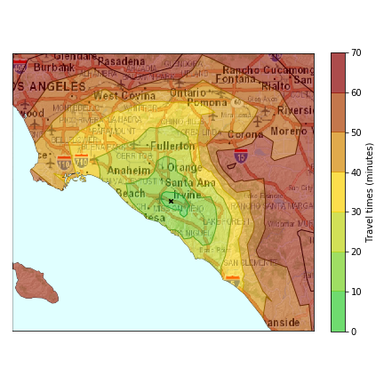
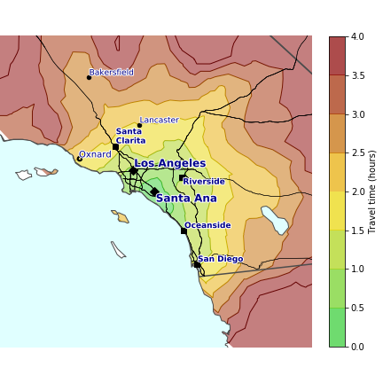

The purpose of this exercise (hosted on [GitHub](https://github.com/ilmonteux/mapping/blob/master/chronomaps/)) is to generate **chronomaps**, that is, maps where a segment length on the map reflects travel times instead of distances. The end results are shown in the header above.

We will start by using the Google Maps Distance Matrix API to calculate travel times between a starting location and a grid of points around that origin.  This is all we need as input data: first, we can generate fixed travel time contours (isochrones) around the origin. Then, to generate a chronomap, we just need to change the map in the following way: for each point at a given (real) distance from the origin, we remap it to a different point that lies on the same direction but has a different radial distance, which will be given by the travel time to that point from the origin.

We can apply this transformation to any map point that we want to remap. First, one could take the map image (for example, with roads and topographical information from the ArcGIS ESRI service) and remap each pixel, but unfortunately the result is very distorted. For example, any text in the map (labelling roads or cities) gets distorted because the text spans a large area: the travel times to the points under each side of the text label are different, and so the text gets spanned and distorted.

If I had access to the underlying dynamic Google Maps (or ArcGIS) building pipeline, I could independently transform any feature of the map, attach labels to the transformed points, and then render the new map. 

Maybe this can be done with OpenStreetMaps (?), but for the scope of this project, I will build my own map from a short list of features: country and state borders, coastlines, main highways, and the main cities in the range that is being plotted. From the standard map, I will transform each coordinate for all of these features and then render a *chronomap* including all those features. It is straightforward to include other features (some in my mind: counties, forests, topography).

Some of the resulting chronomaps are shown above in the header. The rest is shown next in the [Results](#results) section, while the detailed walkthrough explaining how the code runs is below in the [Tutorial](#tutorial) section below.

## Results

### Chronomaps of US cities


### Chronomaps of continental US


### Animations
Check out the following visualizations to better understand the concept of chronomap: here I show a standard topo map, overlayed with travel isochrones that progressively fill the whole map (as a driver would starting from the origin). Then, the map is smoothly transitioned to the corresponding chronomap (click on each video to play it). 

First I show animations of a sample of US cities:

<div style="display:none;" class="html5gallery" data-skin="vertical" data-width="360" data-height="420" >
       <!-- Add videos to Gallery -->
		<a href="https://github.com/ilmonteux/mapping/raw/master/chronomaps/animations/animation_Irvine.mp4"></a>
		
		<a href="https://github.com/ilmonteux/mapping/raw/master/chronomaps/animations/animation_SF.mp4"></a>
		
		<a href="https://github.com/ilmonteux/mapping/raw/master/chronomaps/animations/animation_Sea.mp4"></a>
		
		<a href="https://github.com/ilmonteux/mapping/raw/master/chronomaps/animations/animation_Den.mp4"></a>
		
		<a href="https://github.com/ilmonteux/mapping/raw/master/chronomaps/animations/animation_Chi.mp4"></a>
		
		<a href="https://github.com/ilmonteux/mapping/raw/master/chronomaps/animations/animation_DC.mp4"></a>
		
		<a href="https://github.com/ilmonteux/mapping/raw/master/chronomaps/animations/animation_NY.mp4"></a>
</div>

<br>
I also made animations for chronomaps of the whole continental contiguous United States (lower 48), given different travel origins:

<div style="display:none;" class="html5gallery" data-skin="vertical" data-width="648" data-height="520" >
		<a href="https://github.com/ilmonteux/mapping/raw/master/chronomaps/animations/animation_US_LA.mp4"></a>

		<a href="https://github.com/ilmonteux/mapping/raw/master/chronomaps/animations/animation_US_center.mp4"></a>

		<a href="https://github.com/ilmonteux/mapping/raw/master/chronomaps/animations/animation_US_NY.mp4"></a>

</div>


Interesting tidbits of information apparent in the videos above:
- notice how, when transitioning to the chronomap, certain cities move away from the departure point, while others move closer. This happens when the destination is further away (in travel time) than one would naively think by looking at the distance.
- notice how most distortions are related to the highway network. This was obviously expected, as the fastest way to get somewhere is through freeways.

## Tutorial

This is a short walkthrough of the Jupyter notebooks available on my [GitHub](https://github.com/ilmonteux/mapping/blob/master/chronomaps/). Head over there to see the gritty details, and to reproduce the maps or make your own.

### Setup
The environment can be replicated loading conda's file `requirements.txt` available on [GitHub](https://github.com/ilmonteux/mapping/blob/master/chronomaps/requirements.txt), via `conda create --name <envname> --file requirements.txt`.

A few packages not available on conda for all platform can be installed with `pip`.

### Google Maps API calls
Google Maps has several APIs. We will mostly use the Distance Matrix API: as its name suggests, this API returns travel distance and time for a matrix of origins and destinations (e.g. if I have 5 origins and 10 destinations, it will calculate travel info for all 50 trips between each of the origins and each of the destinations). I have learned how to use the API from the walkthough at [drewfustin.com/isochrones/](drewfustin.com/isochrones/), take a look there for more details.

The API is called by forming a web address of the form:
```
https://maps.googleapis.com/maps/api/distancematrix/json?mode=driving&origins=ORIGIN&destinations=DESTINATION&key=API_KEY
```
Here the default travel mode is driving, one can specify route options (e.g. avoid ferries, tolls, by  adding `&avoid=ferries|tolls`). The `origins` and `destinations` are formatted as either a string (e.g. an address) or a latitude,longitude pair, and can each be separated by `|` if there are multiple of either one. So for example a typical call will have `origins=lat0,lon0&destinations=lat1,lon1|lat2,lon2|lat3,lon3`. The `key` specification is followed by your API key, which you can get for free on the Google Developer platform.

> Note: as of July 2018, Google has switched from their old free API system (where a free user had quota on daily API calls) to a pay-as-you-go system where each API call is billed to your account, **but** where they provide a 200USD monthly credit. For the basic Distance Matrix calls, the price is 0.005 USD/element (each call requests `n_origins * n_destinations` elements), which taking the credit into account corresponds to 40,000 free elements per month. Keep an eye on your total usage if you use the API a lot!


We create a function that generates that URL, loads it and then reads the JSON file returned by Google:

```python
def call_Gmaps_travel_API(origin, dest_list,  config_file='gmaps_config.cfg', verbose = False):
    """
    Calls Google Maps Distance Matrix API given an origin and (list of) destination(s).
    Returns (lists of) travel distances and times.
    """
```
First we read the API key so that we can include it in the URL:
```python
    config = ConfigParser.SafeConfigParser()
    config.read(config_file)
    key = config.get('api', 'api_number')
```
The API key is stored in a configuration file named `gmaps_config.cfg`, which has the simple content:
```
[api]
api_number=YOUR_API_KEY_GOES_HERE
```

We then take the origin and destination(s), which are expected to be passed as (lists of) (lat,lon) pairs, and transform them into strings that will be inserted in the URL, putting a `|` in between multiple destinations if needed:
```python
    #make string of origin
    origin_str = ','.join(map(str, origin))
    
    # check input, then make string of destination(s)
    if isinstance(dest_list[0], (float,int)) and len(dest_list)==2:
        dest_str = ','.join(map(str, dest_list))
    elif all(map(lambda l: len(l)==2 and isinstance(l[0], (float, int)) , dest_list)): 
        dest_str = '|'.join([ ','.join(map(str, dest)) for dest in dest_list])
```
We then build the URL, load it and read the JSON output:
```python
    # build API URL to query
    units = '&units=imperial' if flag_miles else ''
    prefix = 'https://maps.googleapis.com/maps/api/distancematrix/json?mode=driving'+units
    full_url = '{0}&origins={1}&destinations={2}&key={3}'.format(prefix, origin_str, dest_str, key)
    if verbose: print full_url
    
    # call url and read json
    req = urllib2.Request(full_url)
    f = urllib2.build_opener().open(req)
    d = json.load(f)

```
Finally, we extract the travel time and distance for the travel. If Google Maps could not find a route to the destination, we return very large numbers (1M seconds=11.6 days), which will later be filtered out.
```python
   # Parse the json to pull out the geocode
    times, dists = [], []
    for row in d['rows'][0]['elements']:
        if  row['status'] == 'OK': # all good
            times.append(float(row['duration']['value'])) # make float for easier parsing later on 
            # return distance in miles or km
            dist = row['distance']['value']*(meters_to_miles if flag_miles else 0.001)
            dists.append(dist) 
            
        else: # no route to get there: return very large number
            times.append(1000000.) 
            dists.append(1000000.) 
        
    return times, dists
```

> Fun fact: even if one specifies `units=imperial` in the API call, the distance returned in `d['rows'][0]['elements']['distance']['value']`is in meters and not miles. The API does return the distance in miles in the next entry, `['text']`, which is a string. I have defined a global boolean flag `flag_miles` that makes sure all distances are consistently returned in miles or kilometers.

Another useful API is the GeoCoding API, which returns the geographic coordinates (latitude, longitude) of a street address. The syntax for the call is:
```
https://maps.googleapis.com/maps/api/geocode/json?address=ADDRESS&key=API_KEY
```
where the address is passed as a string. Another function, `call_Gmaps_coords_from_address(address, config_file='gmaps_config.cfg', verbose = False)`, similar to the one described above, returns the geographical coordinates of a string address. 

I then defined some more functions that help to build a 2D grid around a point:

```python 
def move_from_to_xy(p0, dist_x, dist_y):
    """
    Given an origin point p0=(lat,lon), return a (lat,lon) point found moving in the East-West
    and North-South directions by dist_x and dist_y, with distances given in miles/meters.
    Negative inputs correspond to moving South and West.
    """
    lat, lon = p0
    # Easy to remember: 1 nautical mile is 1 minute of longitude at the equator
    dist_x, dist_y = map(lambda x: x * miles_to_meters if flag_miles else x, (dist_x, dist_y))
    # displacements in lat,lon degrees
    dlat = dist_y/nautical_miles_to_meters/60.
    dlon = dist_x/nautical_miles_to_meters/60./cos(radians(lat))
    return [ lat+dlat, lon+dlon ]

def move_from_to_angle(p0, dist_r, alpha):
    """
    Given an origin point p0=(lat,lon), return a (lat,lon) point found moving in the direction defined
    by the bearing alpha (in radians, angle between N and direction), with radial distance given in miles/meters.
    """

    lat1, lon1 = map(radians, p0)
    # displacements in lat,lon
    lat2 = asin( sin(lat1) * cos(dist_r / r_earth) + cos(lat1) * sin(dist_r / r_earth) * cos(alpha) )
    lon2 = lon1 + atan2( sin(alpha) * sin(dist_r / r_earth) * cos(lat1), cos(dist_r / r_earth) - sin(lat1) * sin(lat2))
    return map(degrees, [ lat2, lon2 ])
```

Starting from an origin point, those functions return another point found moving by a certain distance either in the East/West and North/South direction or along a direction defined by the bearing `alpha` (here we use the [Haversine formulas](https://en.wikipedia.org/wiki/Haversine_formula), which are a simple application of trigonometry on a round Earth).

By iterating these displacements, I can generate rectangular and polar grids around an origin point. The functions that for each type of grid are `make_xy_grid(p0, max_time, nx, ny, max_speed = 70.)` and `make_polar_grid(p0, max_time, n_radial, n_angles, max_speed = 70)`.

Finally, we can call the Distance Matrix API function above on each point of a grid, given a starting location. The function `run_travel_grid(p0, grid)` does exactly that:

```python
def run_travel_grid(p0, grid):
    """
    Calls Google Maps Distance Matrix API to find distance between p0=(lat,lon) and each of the
    grid points in grid. Returns grid, times (in seconds), distances (in miles/km).
    """
    # free API rate limits: no more than 25 destinations per call
    grid_chunks = chunks(grid, 25)
    grid0, times, dists = [], [], []
    for dest_list in grid_chunks:
        grid0.append(dest_list)
        tt, dd = call_Gmaps_travel_API(p0, dest_list)
        times.append(tt)
        dists.append(dd)
```

With an understanding of all of these functions, we have all we need to generate the data needed to make all the following plots.

### Make isochrones
In this section I will be going through the Jupyter notebook [travel times.ipynb](https://github.com/ilmonteux/mapping/tree/master/chronomaps/travel%20times.ipynb).

We define a starting point and then make a grid of points around it. In my map, I have computed travel times starting from Irvine, CA.

```python
# pos0 = krm.call_Gmaps_coords_from_address('Irvine, CA')
city = [ci for ci in cities_us if ci['name']=='Irvine'][0]
pos0 = [city['latitude'], city['longitude']]
```
For reasons that will be clear when the chronomaps are made, for the starting coordinates I picked the ones given by `geonamescache` instead of the result of Google Maps. Given that the coordinates of a city are not a sharply defined concept, there will be smaller differences between what each database returns, and it should not be a problem.

For defining the grid around the origin, I make a mixed rectangular/polar grid (with 24824 points in the rectangular grid, and a polar grid with 24 bearings and 20 points along each bearing), that spans a maximum distance of 175 miles (2.5 hours\*70mph) from the origin in each direction. Because I will be later interested in zooming in near the origin, I also add a smaller rectangular 10\*10 subgrid with a semiaxis of 10 miles (10hours\*1mph), which will allow me to have dense data near the origin. Finally, I throw away all the points that are not on land, using the `is_land` method of `Basemap` (which reads the GSHHG shoreline database) iterated over the grid.


The travel times are simply found by calling:

```python
_, times, dists = krm.run_travel_grid(pos0, grid)
```

With the data on hand, it is now easy to draw contours on top of the map. We just need to unzip the grid into `x,y,z` vectors for `matplotlib`, and then make a contour (using `plt.tricontourf` because the grid is unstructured).

```python
y,x = zip(*grid)     # NB: lat,lon=y,x
z = np.array(times)/60.   # time now in minutes
xx, yy, zz = zip(*[ el for el in zip(x,y,z) if el[-1]!=1000000./60])    # clean dataset
```

Because I made a lot of these plots, I defined a function that does all the work:

```python 
def make_contour_map(x,y,z, ax, levels, pos0='', service='World_Street_Map', xpixels=500, EPSG = 2229, resolution='l', cbarlabel='Travel Times (minutes)', rebox=0.1, cbarfraction=0.045, cbarextend='max'):
    
    LL , UR = (min(x)+rebox, min(y)+rebox), (max(x)-rebox, max(y)-rebox)
    
    themap = Basemap(llcrnrlon=LL[0],llcrnrlat=LL[1],urcrnrlon=UR[0],urcrnrlat=UR[1], epsg=EPSG, ax=ax, resolution=resolution)
    if service == 'shadedrelief': themap.shadedrelief()
    else:
        try: themap.arcgisimage(service=service,xpixels=xpixels)
        except: themap.arcgisimage(service='World_Street_Map',xpixels=xpixels)
    
    xm, ym = themap(x,y)
    (z, levels) = (np.array(z)/60., np.array(levels)/60.) if 'hours' in cbarlabel else (z, levels)
    
    cols = [cmap(1.2*lev/levels[-1]) for lev in levels]
    ax.tricontour(xm,ym,z, levels=levels, colors=map(lambda c: krm.lighten_color(c,1.2), cols),linewidths=1)
    im=ax.tricontourf(xm,ym,z, levels=levels, colors=cols, alpha=0.5, antialiased=True,extend=cbarextend)
    cb = plt.colorbar(im, ax=ax, label=cbarlabel, fraction=cbarfraction, extendfrac=0.)
    cb.set_alpha(0.7)
    cb.draw_all()

    patches = patch_mask_oceans_lakes(themap, ax, aquacolor='lightcyan')
    for p in patches: ax.add_patch(p)

    return ax
```

This functions create a Basemap projection (given an EPSG code), draws a background, which by default is `World_Street_Map `, then draws contours of `z` over it and puts a legend bar (assumed to be in minutes, but can be in hours if specified). The function `patch_mask_oceans_lakes()` adds a water layer that covers up all the oceans/lakes with a cyan color, where the shorelines are defined by the BaseMap projection (the code comes from [this StackOverflow answer](https://stackoverflow.com/a/48624202)). 

The resulting figures are as follows (here I show the full range and then a zoom into the 1-hour range near Irvine):




> Note: given the coarseness of the grid, to make all the plots I averaged the travel times over N=5 nearest points (each point is averaged with 4 nearest neighbors), with the function `smoothen2d()` defined in the module. This reduces the noise level to achieve nice-looking plots.

#### Isochrones on interactive maps
The graphics above have two drawbacks: first, they are static (cannot zoom in to see more details) and second, the quality of the map layer (via arcGIS's `World_Street_Map `) is low: the details of the map are pixelated, and I could find no way to improve this (maybe it makes sense, it is a free service after all). 

Fortunately, this can be solved with [mplleaflet](https://github.com/jwass/mplleaflet), "a package that can transform and matplotlib plot into a webpage with a pannable, zoomable [Leaflet](http://leafletjs.com/) map".

The mplleaflet figure is easily made:
```python
fig, ax = plt.subplots(1,1,figsize=(5,4))
ax.tricontourf(xx,yy,zz, levels=levels,colors=cols,alpha=0.5)
ax.tricontour(xx,yy,zz, levels=levels,colors=map(lambda c: krm.lighten_color(c,1.2), cols),linewidths=1);
mplleaflet.show(fig=ax.figure, path='figs/travel_map_Irvine.html')
```
> Note: there seems to be a bug in the opacity rendering of mplleaflet. I fixed it by defining a function that reads the HTML file and adds a `"fillOpacity":0.5, ` to all filled contours.

This results are [interactive webpages](/chronomaps/interactive_isochrones/) with OpenStreetMap background and a filled contour shading (also seen here in an iframe):

<iframe src="/assets/htmls/chronomaps/travel_map_Irvine.html" style="width: 40%; height: 300px"></iframe>
<iframe src="/assets/htmls/chronomaps/travel_map_NY.html" style="width: 40%; height: 300px"></iframe>

Check out [chronomaps/interactive_isochrones/](/chronomaps/interactive_isochrones/) for all the other interactive webpages.


### Make chronomaps
This section follows the Jupyter notebook [chronomaps.ipynb](https://github.com/ilmonteux/mapping/tree/master/chronomaps/chronomaps.ipynb). 

We now want to transform the isochrone maps above so that the distance on the map corresponds to travel times instead of linear distance along Earth's surface. The key function to do this will be the following:

```python
def morph(pp, p0, func, projmap=''):
    """
    Input should be (lon,lat) coordinates. If projmap='', compute angles between (lon,lat) points, otherwise 
    between projection coordinate points defined by the projection map passed in input.
    """
    (dy, dx) = (pp[1]-p0[1], pp[0]-p0[0]) if projmap=='' else (projmap(*pp)[1]-projmap(*p0)[1], projmap(*pp)[0]-projmap(*p0)[0])
    r = np.sqrt(dx**2 + dy**2)
    theta = np.arctan2(dy, dx)
    new_r = func(pp) # new radius
    return [new_r*np.cos(theta), new_r*np.sin(theta)]
```
This function simply decomposes a point (given as (lon,lat) pair of coordinates) into radial coordinates from the origin `p0`, `(dx,dy)-> (r,theta)`, computes a new radius given by the input function (which will give the travel time), and returns a `(x',y')` pair in the same direction with respect to the origin as the original point but with a new radius given by the travel time.

Given that we have the travel times only on a discrete set of grid points and we want to rescale map features at arbitrary points, we need to interpolate the travel times over the input grid.  After trying the `interp2d, NearestNDInterpolator, LinearNDInterpolator, Rbf` methods of `scipy.interpolate`, I saw that the best results (more accurate, less noisy) were given by `Rbf` (radial basis function approximator) with linear method.

```python 
from scipy.interpolate import interp2d, NearestNDInterpolator, LinearNDInterpolator, Rbf

func1 = interp2d(xx,yy,zz)
func2 = NearestNDInterpolator(zip(xx,yy),zz)
func3 = LinearNDInterpolator(zip(xx,yy),zz)
func4 = Rbf(xx,yy,zz, function='linear')
func5 = Rbf(xx,yy,zz)

def time_func(pp):
    return  func4(*pp)
```

We can now feed any point of any feature in `morph()` with input function `time_func` and the resulting map will, by construction, be a chronomap. In order to actually draw the chronompas, we will need a to go through a short detour to import features to display on the map.

#### Import additional datasets

- US state borders: I have downloaded the state geometry from the [US census bureau](https://www2.census.gov/geo/tiger/TIGER2010DP1/). We import the database with `geopandas`, namely with `GeoDataFrame.from_file(FILE.dbf)`.
- roads: again those are downloaded from the [US census bureau](https://catalog.data.gov/dataset/tiger-line-shapefile-2016-nation-u-s-primary-roads-national-shapefile) and loaded with `geopandas`. They are defined as:

    > Primary roads are generally divided, limited-access highways within the interstate highway system or under State management, and are distinguished by the presence of interchanges

- cities: we use the [GeoNames](https://www.geonames.org) dataset, accessible through `GeoNamesCache` in python, which can easily be installed as a `conda` package (on Windows only, use `pip` on Mac/Linux). It contains information about countries, states and cities all over the world, but we will be interested in the cities dataset. We then filter the dataset to only get the list of US cities:

    ```python
import geonamescache
gc = geonamescache.GeonamesCache()
cities_us = [gc.get_cities()[ci] for ci in gc.get_cities().keys() if gc.get_cities()[ci]['countrycode']=='US']
    ```
    This dataset contains 3233 cities, for each of which we have coordinates as well as name and population (which seems to have a lower limit at 10K). We will want to show this cities on a map, and as cartographers have done for centuries, we want to show big cities prominently. To do this, we will change the marker and font size of a city to be proportional to the city population, with the following functions:
    
    ```python
def map_point_style(pop, bins=np.array([.01,.05,.1,.5,1,3])*10**6, markers=['.','.','o','o','$\circ$','s','D'], sizes=[5,8,10,20,70,40,50]):
    ibin = np.digitize(pop, bins)
    return dict(marker=markers[ibin], s=sizes[ibin] )
def map_font_style(pop, bins=np.array([.01,.05,.1,.5,1,3])*10**6, sizes=[7,8,9,9,10,9,12], extradict={}):
    ibin = np.digitize(pop, bins)
    weights= (['normal']*(len(bins)-1)+['bold','bold'])
    out = dict(fontsize=sizes[ibin] , weight=weights[ibin])
    out.update(extradict)
    return out
    ```
    In addition, to make beautiful plots I do not want too many overlapping cities, or it would be a mess: therefore, I define a function so that a large city with nearby smaller suburbs incorporates them.
    
    ```python
    def cluster_cities(cities, dist_cut=25, pop_cut=1.):
    """
    Cluster nearby cities, such that each city iteratively absorbs smaller cities within dist_cut of itself.
    """
    for ci in cities:
        if any([len(ci2)>4 and ci[2] in ci2[4] for ci2 in cities[:cities.index(ci)] ] ):
            continue # skip to next city
        absorbed_cities = [ ci2 for ci2 in cities if krm.get_distance((ci[1],ci[0]),(ci2[1],ci2[0])) < dist_cut and 1.*ci[3]/ci2[3]>=pop_cut]
        # if len(absorbed_cities)==1: print ci[2]
        ci.append( [ ci2[2] for ci2 in absorbed_cities])
        ci.append(sum([ ci2[3] for ci2 in absorbed_cities]))
    return cities
    ```
    From an input of cities, each passed as `[lon, lat, name, population]`, for each city this looks at cities within a certain radius (25 miles by default) and adds the population of any smaller city to the city around which we are looking. The list of cities returned is then `[lon, lat, name, population, clsutered_cities_names, clsutered_cities_populations]`: as an example, take Los Angeles, which has 3.97M people in the GeoNamesCache database. Within a 25 miles radius, we have Long Beach (474k) and Anaheim (350k), and many more. Summing together all the 113 cities within a 25 miles of Los Angeles, there are 11M people! So when drawing the map, I will not draw any of the smaller cities and just assign 11 million people to Los Angeles.
  
#### Chronomaps
Finally, we are now equipped to make chronomaps that are visually recognizable. As I will be making many of these figures, I wrote a function that will return the whole chronomap, `make_chronomap(x,y,z, ax, projmap, p0, levels, lim = 155, plot_states=True, plot_cities=True, dist_cut=25, n_cities_cut=20, small_city_radius=0, plot_roads=True, roads='', plot_water=True, cbarlabel='Travel time (hours)', theta='', water_lw=1, zorder_water=3)`

The salient parts fo the function are just iterating the `morph` function over different features. For example, to plot state borders:

```python
if plot_states:
    states = [st for st in state_border.keys() if any([is_in_range(pp,x_range,y_range,) for pp in zip(*state_border[st])])]
    for st in states:
        mbo = [morph(pp, p0, time_func, projmap=themap) for pp in zip(*state_border[st])]
        ax.plot(*zip(*mbo),c='0.3',zorder=2)

```
Or, to plot roads:
```python
if plot_roads:
    for name, road in roads:
        mbo = [morph(pp, p0, time_func, projmap=themap) for pp in road]
        ax.plot(*zip(*mbo), c='k',lw=.5)
```
For the cities markers and names, I use the `cluster_cities()` mentioned above:

```python
cities = [[ci['longitude'],ci['latitude'],ci['name'],ci['population']] for ci in 
         sorted([ ci for ci in cities_us if is_in_range([ci['longitude'], ci['latitude']],x_range, y_range)]
                 , key = lambda ci: ci['population'], reverse=True) ]
cities = cluster_cities(cities, dist_cut)
cities_plot = [ci for ci in cities if (len(ci)>4 and time_func([ci[0], ci[1]])<levels[-2]) or time_func([ci[0], ci[1]])<small_city_radius]
texts=[]
for ci in reversed(cities_plot[:n_cities_cut]):
    mci = morph([ci[0], ci[1]], p0, time_func, projmap=themap)
    if is_in_range(mci, ax.get_xlim(),ax.get_ylim()) :
        ax.scatter(*mci, c='k', zorder=100, **map_point_style(ci[-1]) )
        font = map_font_style(ci[-1], extradict={'color':'darkblue'})
        texts.append(ax.text(*mci, s=reformat_name(ci[2]), fontdict=font, zorder=100))
for txt in texts: txt.set_path_effects([PathEffects.withStroke(linewidth=2, foreground='w')])
```
Here first I get a list of cities from the GeoNamesCache database, filtering the ones that are in the geographical range of the map, then I cluster them, and finally I plot each city and add a text label with the correct font reflecting the population. The list is reversed because we want a large city to show up on top of a smaller city if their labels overlap. A cool feature of `matplotlib` is the ability to put a white background behind the text to improve readability. This is done via `set_path_effects([PathEffects.withStroke()])` in the last line.

Finally, I plot the isochrones, which by construction are now circles:
```python
for lev in levels[:-1]:
    dlev = (levels[1]-levels[0])
    col=cmap(1.2*lev/levels[-1])
    ax.add_patch(Wedge((0,0),lev+dlev,0,360,width=dlev,facecolor=col,edgecolor=col,alpha=0.5))
```
I find that the map looks better (more intuitive) by adding a water layer with oceans/lakes, which covers the other layers. This is done via the `patch_mask_oceans_lakes()` function mentioned above, with the relative water layer ordering specified by `zorder_water` .




For the last zoomed map, I used the `make_chronomap parameters `dist_cut=10, n_cities_cut=30, small_city_radius=30`: as we are zooming in, I clustered cities with a 10 mile radius, displayed up to 30 cities, and showed all cities within a 30 miles radius of the origin. The resulting map is busy enough, but not too much.

One last comment: the maps would be much messier if it were not for the [adjustText](https://github.com/Phlya/adjustText) package. This package iteratively adjusts the position of text labels to minimize overlaps, while trying to keep the label as close to the original anchor as possible.

### More Chronomaps

After showing step-by-step how to make chronomaps, we can do many more in a batch. We simply define a list of cities, get their coordinates from GeoNamesCache (as before, this could also be done with the Google Maps Geocoding API) and a list of EPSG codes for each city (these can be found on [https://spatialreference.org]()

```python
cities_list = ['San Francisco', 'Seattle', 'Denver', 'Chicago', 'Washington, D.C.', 'New York City']
short_name_list = ['SF','Sea','Den','Chi','DC','NY']
epsg_list = [2226, 2285, 2773, 3435, 2248, 2263]
# pos0_list = [ krm.call_Gmaps_coords_from_address(city) for city in cities_list ]
pos0_list=[]
for name in cities_list:
    city = [ci for ci in cities_us if name == ci['name']][0]
    pos0_list.append([city['latitude'], city['longitude']])
```
As before, we generate grids around the central coordinates:

```python
grid_list = []
for idx in range(len(cities_list)):
    tmpgrid = krm.make_mixed_grid(pos0_list[idx], 2.5, 20, 24, 24, 24) 
    tmpgrid += krm.make_xy_grid(pos0_list[idx], max_time=10, max_speed=1, nx=10, ny=10)
    tmpgrid = grid_is_land(tmpgrid)
    grid_list.append(tmpgrid)
```
Which results in the following grids:


The Google Maps API is called again for each grid:
```python
dists_list, times_list = [], []
for idx in range(len(cities_list)):
    gg, tt, dd = krm.run_travel_grid(pos0_list[idx], grid_list[idx])
    dists_list.append(dd)
    times_list.append(tt)
```
and finally I can make six chronomaps at the same time:
```python 
for idx in range(len(cities_list)):
    ax = axes[idx//3][idx%3]
    ax.set_title(cities_list[idx])
    
    y, x = zip(*grid_list[idx])
    z = np.array(times_list[idx])/60. #minutes
    xx, yy, zz = zip(*[ el for el in zip(x,y,z) if el[-1]!=1000000./60])
    zz = np.array(krm.smoothen2d(xx,yy,zz,9)[-1])
    zz[0]=0.

    themap = themap_list[idx]
    themap0 = themap0_list[idx]
    th0 = th0_list[idx]
    p0 = list(reversed(pos0_list[idx])) # switch lat/lon
    ax = make_chronomap(xx,yy,zz, ax, [themap,themap0], p0, levels=levels, plot_cities=True, plot_roads=not True,
                       roads=roads_list[idx], plot_water=True, dist_cut=30, theta=th0)
```


In the Jupyter notebook I also generate more chronomaps that are zoomed in the 1-hour range near each origin. This is done simply by changing the `levels` specifications and the `lim` argument to determine a smaller range.

Finally, I generate also animations (find them in the [animations](#animations) subsection above, with matplotlib's `FuncAnimation`. The steps involved are the same discussed above, so no need to repeat them here.


That's it at the moment! Get back to the [Results](#results) section to see combined chronomaps, and the videos.